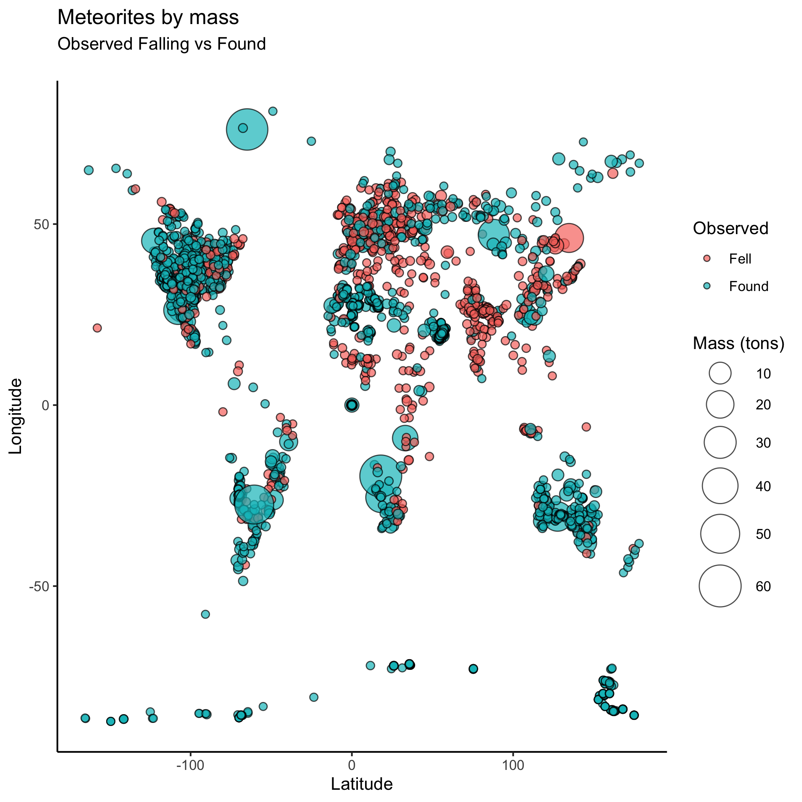

# Meteorite landings
Collected data on meteorites that have fallen to Earth and been found up to the year 2013

# Stracture of project
R project with two pieces of code:
1. A data_cleaning.R file that cleans some data on meteorites.
2. A data_analysis.Rmd file that takes the cleaned data and performs some analysis.
3. A data_visualisation.Rmd that visualises data with longitude and latitude.

# The dataset contains following variables
- id: a unique identifier for the meteorite
- name: the meteorite's name
- mass_g: the mass of the meteorite in grams
- fall: fell - for meteorite that has been seen falling
        found - meteorite's fall was not observed 
- year: the year the meteorite fell, or the year it was found (depending on the value of fell)
- latitude: the latitude of the meteorite's landing
- longitude: the longitude of the meteorite's landing

# The data_cleaning.R file
- read data and change the names of variables to follow naming standards
- split column into 'GeoLocation' latitude and longitude, change type to numeric
- replace any missing values in latitude and longitude with zeros
- remove meteorites less than 1000g in weight from the data
- order the data by the year of discovery
- assertive programming included to ensure that names of variables as we expect & latitude and longitude observations have valid values
- save cleaned data into clean_data folder

# The data_analysis.Rmd file
- read clean data in
- find names and years of ten largest meteorites found
- find the average mass and the total number of meteorites that were recorded falling, vs. those which were just found
- find the number of meteorites in each year, for every year since 2000
- find the average mass of meteorites that were recorded falling, vs. those which were just found
- find the number of meteorites in each year, for every year since 2000
- compare the total number and the average mass of meteorites that were found vs. which were seen falling

# The data_visualisation.Rmd file
- created geographical scatter plot using longitude and latitude 
- the scatter plot displays meteorites by their mass in tons; color grouped by meteorites which were observed falling vs those that were found

- second graph is a histogram, displaying the number of meteorites fallen on Earth by year of discovery